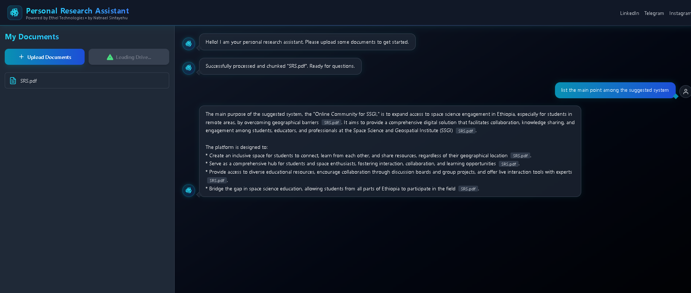

# 🧠 Personal Research Assistant

[](https://reactjs.org/)
[](https://www.typescriptlang.org/)
[](https://ai.google.dev/)
[](https://tailwindcss.com/)
[](LICENSE)

---

## ✨ Overview

**Personal Research Assistant** is a **privacy-first, client-side AI tool** that lets you **upload, read, and converse with your personal documents**. It uses **Google Gemini AI** and a **Retrieval-Augmented Generation (RAG)** pipeline to generate accurate, source-cited answers.

Perfect for:  
- 📚 Students analyzing lecture notes and PDFs  
- 📝 Researchers summarizing papers  
- 💼 Professionals reviewing reports

> "Ask natural questions about your documents and get instant answers based on **your data only**."  

---

## 🚀 Features

- ✅ Upload local PDF, TXT, or MD files  
- ✅ Import files directly from **Google Drive**  
- ✅ AI-assisted Q&A with **source citations**  
- ✅ Multi-document context memory  
- ✅ Sleek modern UI with **glassmorphism & neon accents**  
- ✅ Fully client-side — **no server storage**  

---

## 🧩 System Architecture

<details>
<summary>Click to expand Architecture & Flow</summary>

### Flow

1. **Upload / Import Documents**  
   Use the drag-and-drop interface or Google Drive integration.

2. **Text Extraction**  
   PDFs parsed with **PDF.js**; TXT & MD handled via browser APIs.

3. **Chunking**  
   Splits documents into meaningful "chunks" for efficient AI context management.

4. **Retrieval**  
   Keyword-based search to select top relevant chunks.

5. **Answer Generation**  
   Sends top chunks + user query to **Google Gemini** for concise, source-cited answers.

6. **Conversation Memory**  
   Keep context across multiple questions and documents.

</details>

---

## 🧱 Tech Stack

| Layer | Technology | Purpose |
|-------|------------|---------|
| Frontend | **React 19.2.0** | Component-based UI |
| Language | **TypeScript** | Strongly typed JS |
| Styling | **Tailwind CSS** | Modern, utility-first styling |
| Animations | **Framer Motion** | Smooth motion effects |
| AI | **Google Gemini API** | Contextual answer generation |
| Document Parsing | **PDF.js** | PDF extraction |
| Cloud Integration | Google Drive + Picker API | File import |
| Authentication | Google Identity Services | OAuth 2.0 login |

---

## 📂 Directory Structure

```
/
├── components/
│   ├── ChatInterface.tsx
│   ├── ChatMessage.tsx
│   ├── DocumentManager.tsx
│   ├── Header.tsx
│   └── icons.tsx
├── services/
│   ├── geminiService.ts
│   └── googleDriveService.ts
├── utils/
│   └── fileParser.ts
├── App.tsx
├── index.html
├── index.tsx
├── metadata.json
└── types.ts
```

---

## 📦 Packages & Libraries

| Package | Version | Description |
|---------|---------|------------|
| react | ^19.2.0 | Core UI library |
| react-dom | ^19.2.0 | DOM renderer |
| @google/genai | ^1.28.0 | Gemini API SDK |
| framer-motion | ^12.23.24 | Animations & motion |
| clsx | ^2.1.1 | Conditional classNames |
| pdf.js | 3.11.174 | PDF parsing |
| Google APIs | N/A | OAuth, Drive, Picker |

---

## 💬 Example Queries

- "Summarize Chapter 3 of my PDF."  
- "What are the main points about neural networks?"  
- "List all references in the document."  
- "Who is the recipient in this letter?"  

---

## 🖼️ Screenshots

#### Chat Interface



---

## 🔐 Privacy & Security

- 🔒 Processing happens **locally in-browser**  
- 🔒 Only extracted text snippets are sent to **Gemini API**  
- 🔒 Users control all uploaded documents  

---

## 🔗 Connect with Developer

We are passionate about technology and innovation. Follow our journey and explore more of our work through our social channels. For business inquiries or collaborations, don't hesitate to reach out!

<div align="center">

[](https://linkedin.com/in/natnael-sintayehu-84b669254)
[](https://github.com/ethel-7)
[](https://t.me/natnael_sintayehu)
[](https://www.instagram.com/ethel.tech)
[](https://web.facebook.com/profile.php?id=615673207906

## 🌟 Future Enhancements

<details>
<summary>Click to expand ideas</summary>

- 📘 Local embedding vector search with WASM  
- 📂 Cross-document question memory  
- 🔍 Document auto-tagging & summarization  
- 🎤 Voice input via Web Speech API  
- 📊 Knowledge graph visualization  

</details>

---

✅ Developed by **Natnael Sintayehu**, Founder of **Ethel Technologies**
